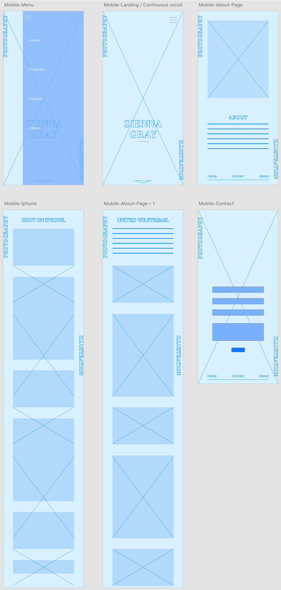
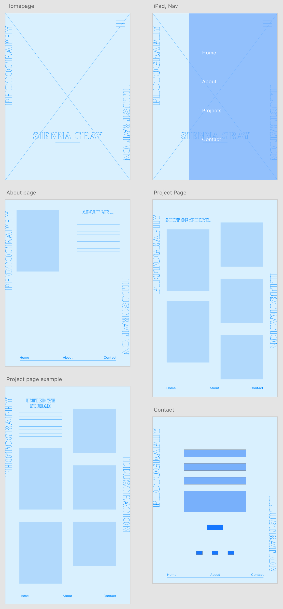
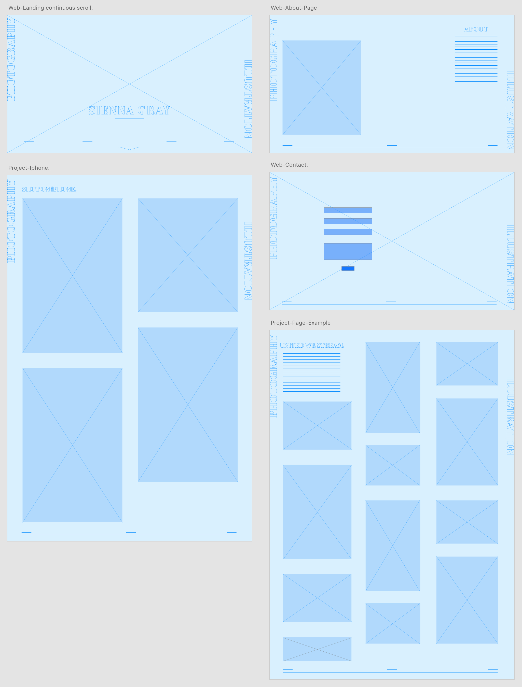
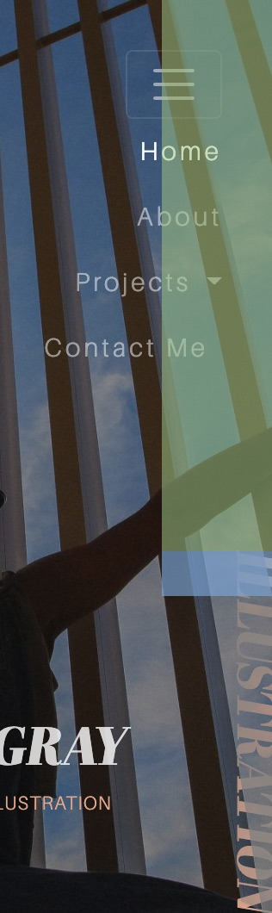

# Sienna Gray Photography and Illustration
### A personal site to provide information and promote the creative work of Sienna Gray.
---
# Project Overview
This is my first milestone project as part of the Full Stack Development diploma for The Code Institute.

My younger sister has been working on her photography portfolio for the last couple of years and has recently had some amazing opportunities,
which has led to an impressive body of work.

Up until now she has been using various social media platforms to promote and contact clients. Which has been making it difficult to keep track of potential and current bookings.
I saw this as a good opportunity to create a simple, clearly structured and eye catching site to further promote Sienna's work and to make it easier for potential clients to reach her.

# UX

## Strategy
The Strategy of Sienna's personal site is to increase the amount of potential bookings and people viewing her work. Futhermore to increase the amount of people contacting her.

---

## Scope
The sites main role is promote work within a creative industry so it will need to be eye catching, user friendly and with a well designed layout that suites the target audience of Sienna's work. 
The owner of the site still has to complete some of the projects that need to be added to the site, therefore it will be made to an MVP standard and if and when contents need to be added it can be.

## User stories
### Visitor goals
1. As a visitor, I want to learn about Sienna's background and services.
2. As a visitor, I want to easilty view her previous work.
3. As a visitor, I want to be able to easily message her through the site.
4. As a visitor, I want to be able to receive her contact details and be able to enter mine.
### Owner goals
1. As the owner, I want the site to be easy to navigate.
2. As the owner, I want the site to clearly promote me and my photography work.
3. as the owner, I want the site to make it easy for potential clients reach me through the site.

---

## Skeleton

### Section 1 - Hero Image/Homepage 
- Navigation bar located at the top of the page overlayed onto the hero image of the owners choice. The navigation bar will collapse to a hamburger icon on smaller screens.
- Creative typography in the form of sideways text in a fixed postiion to the left and right of the page
all the way down the site. As well as it being a design idea it also informs the user what the site is about.
- A main heading which is Sienna's full name with a subheading to make it even clearer to the user what 
the site is about.

### Section 2 - About Page
- Page includes a self portrait image and text block with about info.
- On full width version to the left and right of one another and on the smaller media screens on top of one another.


### Section 3 to 5 - Project Pages
- Pages include h2 heading with the project title and a descriptions about each project.
- Pages inlude the photographs taken during each project in a simple, resposive image gallery.
- Each project page will have a navigation bar at the bottom for the navigation between each section.

### Section 6 - Shot on iPhone page
- Page includes h2 heading
- Page will also have a responsive image gallery but with a smaller amout of collumns than the projects section.
- This page also includes the bottom navigation bar. 

### Section 7 - Contact Page/Form
- Page includes a contact form asking for user name, number, email and the message they would like to send. 
- Social media links 
- Sienna's contact details.

## Wireframes
### Mobile Wireframes



### Medium Screen Wireframes



### Large Screen Wireframes



---

# Testing 


## Bugs found and resolved
### Unresponsive hamburger navigation
The image below shows the ```.right-heading``` class with a padding-top set to 600px in the style.css. This meant that both the hamburger toggler and navigation links in the dropdown 
menu were unresponsive. 



I had three options I could have used to resolve this issue. One was to change the css rule from padding-top to just top and set it to slightly less than the current pixels, that way there would be no padding on the top interfering with the 
buttons. The second option was to change the Z index of both the ```.right-heading``` and ```.dropdown-item``` classes, with dropdown items being of a higher Z index. A third option, which is the one I opted for, was to change
the style rule to a percentage from the bottom like so:
```css
.right-heading {
    position: fixed;
    right: -12px;
    font-family: abril-fatface, sans-serif;
    font-size: 80px;
    font-weight: 400;
    font-style: italic;
    writing-mode: vertical-rl;
    text-orientation: sideways;
    -webkit-text-stroke: 1.5px #EFA484;
    -webkit-text-fill-color: transparent;
    margin: 0;
    box-sizing: content-box;
    width: 69px;

    * bottom: 13%; *

    mix-blend-mode: exclusion;
    z-index: 4;
}

```
I chose this option not only because it fixed the bug but also made the ```.right-heading``` more responsive to the viewport height.


