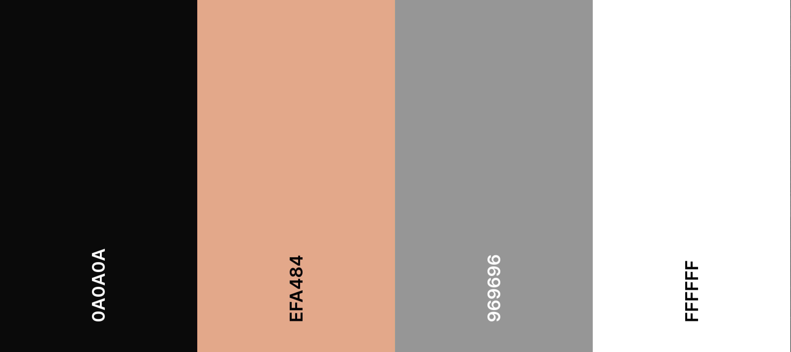
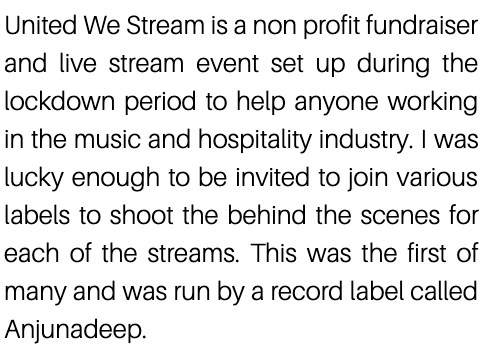
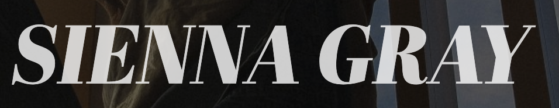
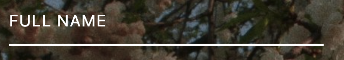
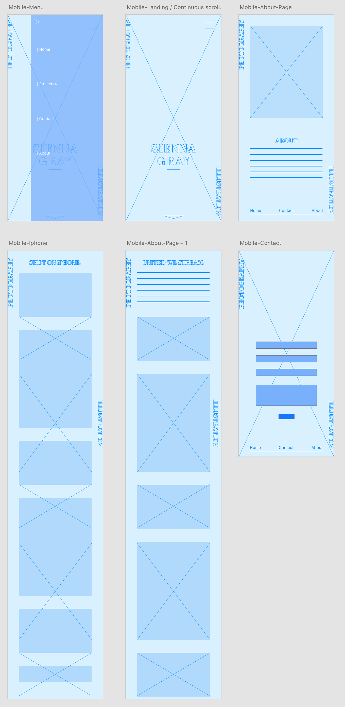
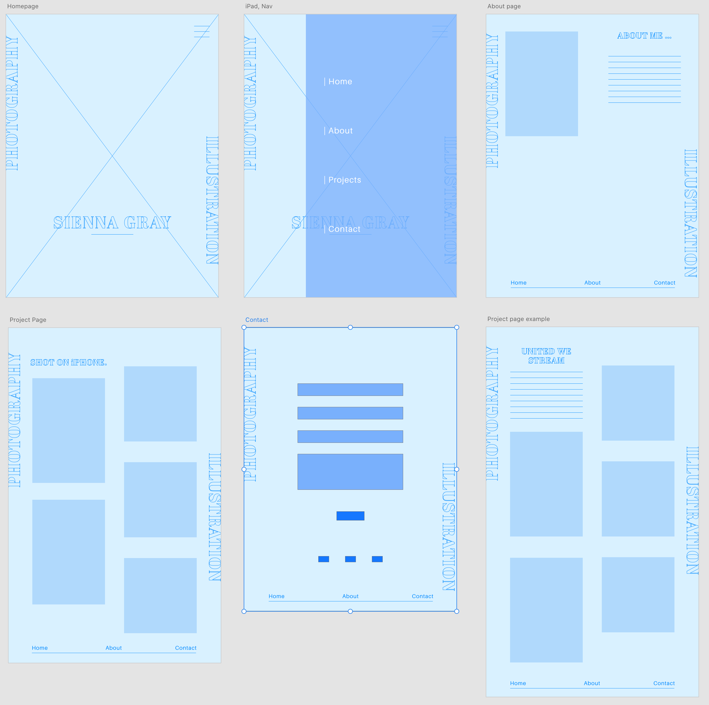
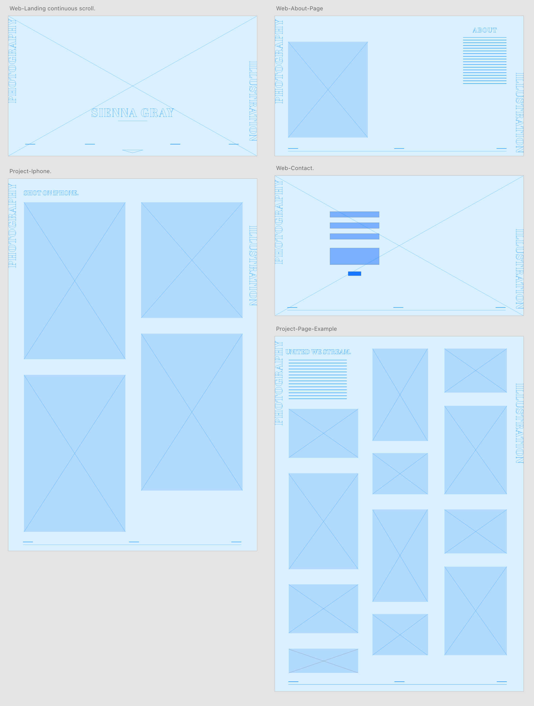
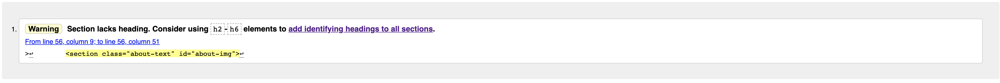
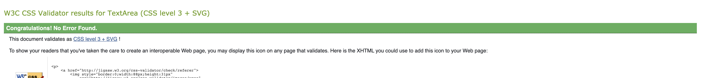

# Sienna Gray Photography and Illustration
### A personal site to showcase and promote the creative work of Sienna Gray.


Site Link: https://connorgray97.github.io/Sienna-Website/

---
# Table of contents

[UX](#UX)

[Design](#design)

[Wireframes](#Wireframes)

[Technologies Used](#tech-used)

[Testing](#testing)

[Bug fixes and known bugs](#bug-fixes)

[Deployment](#deployment)


# Project Overview
This is my first milestone project as part of the Full Stack Development diploma for The Code Institute.

My younger sister has been working on her photography portfolio for the last couple of years and has recently had some amazing opportunities,
which has led to an impressive body of work.

Up until now she has been using various social media platforms to promote and contact clients. Which has been making it difficult to keep track of potential and current bookings.
I saw this as a good opportunity to create a simple, clearly structured and eye catching site to further promote Sienna's work and to make it easier for potential clients to reach her.
<a name="UX"></a>
# UX 

## Strategy
The Strategy of Sienna's personal site is to increase the amount of potential bookings and people viewing her work. Futhermore to increase the amount of people contacting her.

---

## Scope
The sites main role is promote work within a creative industry so it will need to be eye catching, user friendly and with a well designed layout that suites the target audience of Sienna's work. 
The owner of the site still has to complete some of the projects that need to be added to the site, therefore it will be made to an MVP standard and if and when contents need to be added it can be.

## User stories
### Visitor goals
1. As a visitor, I want to immediately be impressed when opening the site.
2. As a visitor, I want to easily understand the role of the site and what services may be provided.
3. As a visitor, I want to learn about Sienna's background and services.
4. As a visitor, I want to easily view her previous work.
5. As a visitor, I want to be able to easily message her through the site.
### Owner goals
1. As the owner, I want the site to be easy to navigate.
2. As the owner, I want the site to clearly promote me and my photography work.
3. as the owner, I want the site to make it easy for potential clients reach me through the site.

<a name="design"></a>
## Design
### Colour Scheme



For the colour palette I wanted to pick colours that sat well with all the imagery used on the site and that didn't draw the users attention away from the photography too much.
I noticed that on all of my Sister's photos there is this nice orange hue that slightly comes through. After a little playing around with what I thought was nice we both came to choose 
[#EFA484] which was used as little splashes of colour thoughout the site, being used on various headings and on links when hovered over. 

[#969696] Was used on the navigation bars located at the bottom of each of the section. These were originally the orange colour but I felt that I could improve the contrast ratio so I opted for the grey.

[#0A0A0A] Was used on the sections largest headings. Simple, bold and eye catching but doesn't obstruct any of the imagery. The [#FFFFFF] was then used as the inverse headings for the sections with the orange background.
This was to keep the site interesting on the eyes as you scrolled down the page.

### Typography

- The font used in the main bodies of text and text blocks was Google Fonts 'Aileron' with a weight of 100, styles of lowercase and uppercase, with sans-serif used as a fallback font. 
Simple easy to read and was a great match with the fonts used on the landing page and headings.



- All large headings used Google Fonts 'Abril-Fatface' also with sans-serif as a fallback font. For the landing page I used an italicised version and for each sections 
main heading I used regular with a weight of 400. This was to continue with the theme of the landing page.



- For the contact page and sub headings uppercase 'Aileron' was used because it's really clear and easy to read. It was also a nice match with the other fonts and font styles used across the site.



## Skeleton

### Section 1 - Hero Image/Homepage 
- Navigation bar located at the top of the page overlayed onto the hero image of the owners choice. The navigation bar will collapse to a hamburger icon on smaller screens.
- Creative typography in the form of sideways text in a fixed postiion to the left and right of the page
all the way down the site. As well as it being a design idea it also informs the user what the site is about.
- A main heading which is Sienna's full name with a subheading to make it even clearer to the user what 
the site is about.

### Section 2 - About Page
- Page includes a self portrait image and text block with about info.
- On full width version to the left and right of one another and on the smaller media screens on top of one another.


### Section 3 to 5 - Project Pages
- Pages include h2 heading with the project title and a descriptions about each project.
- Pages inlude the photographs taken during each project in a simple, resposive image gallery.
- Each project page will have a navigation bar at the bottom for the navigation between each section.

### Section 6 - Shot on iPhone page
- Page includes h2 heading
- Page will also have a responsive image gallery but with a smaller amout of collumns than the projects section.
- This page also includes the bottom navigation bar. 

### Section 7 - Contact Page/Form
- Page includes a contact form asking for user name, number, email and the message they would like to send. 
- Social media links 
- Sienna's contact details.

<a name="Wireframes"></a>
## Wireframes

[Mobile Wireframe](https://xd.adobe.com/view/2495ed86-ca46-4683-a724-b036d7f20825-71c6/)
---



[Ipad Wireframes](https://xd.adobe.com/view/716cc31a-4b4f-48b3-8c9f-d2759a8f4409-243f/)
---




[Desktop Wireframes](https://xd.adobe.com/view/7b1150ed-1739-47a9-95a1-fa82d84c8113-2e42/)
---



## Mockups 

[Large screen mockups](https://xd.adobe.com/view/d56ceb9a-6946-4320-9864-3b0e97968112-803f/)

[Mobile mockups](https://xd.adobe.com/view/07929eeb-00e8-46e0-8a9f-f0c6010caf17-52c1/)

### Changes since original wireframes

- I opted for a top navigation bar on the landing page as oposed to the originally planned bottom nav bar, I felt it sat better with the hero image used and didn't obstruct the view of it as much.
- The hamburger dropdown menu is now transparent background in the top right.
- The contact form doesn't have a bottom nav but now has a back to top button. 


---

<a name="tech-used"></a>
# Technologies Used
### Languages Used

-  [HTML5](https://en.wikipedia.org/wiki/HTML5)

-  [CSS3](https://en.wikipedia.org/wiki/Cascading_Style_Sheets)

### Programs & Frameworks used

[Google Fonts:](https://fonts.google.com/)

- Google fonts, Abril-Fatface, Aileron and serif were used throughout the project with sans-serif set as the backup. All linked in the head of the project to increase loading times.

[Bootstrap 4.0.0:](https://getbootstrap.com/docs/4.0/)

- Bootstrap was used for the navigation bar and throughout to help with the responsiveness.

[Font Awesome](https://fontawesome.com/)

- Font Awesome was used for the social icons in the contact form and the downwards chevron on the homepage.

 [jQuery:](https://jquery.com/)

- jQuery was used for the navbar toogler and dropdown menu.

[Git](https://git-scm.com/)

- Git was used for version control by utilizing the CLI to push and commit to GitHub.

[GitHub:](https://github.com/)

- GitHub used to store the code.

[AdobeXD](https://www.adobe.com/uk/products/xd.html)

- Adobe XD was used to produce the wireframes and Mockups for the project.

[Jpeg Optimizer](http://www.jpeg-optimizer.com/)

- I used this jpeg optimizer to compress all the imagery to help with performance results.


<a name="testing"></a>
# Testing 

### Code validation

Checking for any Syntax errors was done using the W3C HTML5 and CSS3 validators.

-  [W3C Markup Validator](https://validator.w3.org) - 
This warning was expected as I purposly didn't include a heading. 

-  [W3C CSS Validator](https://jigsaw.w3.org/css-validator/#validate_by_input) - 

### Lighthouse in dev tools

Both mobile and desktop tests came back with high scores. Some improvements can be made to the performance which was expected with such an image heavy site. I used http://www.jpeg-optimizer.com/ to compress the images
to a point where the image quality wasn't lost too much. A possible future solution to the performance could be to include a loading page when the site starts up so the user isn't looking at a half loaded page.

Responsiveness was also tested extensively in the dev tools, on multiple device types.

---


### Functionality Testing
- #### Navigation bar
    - All links are working and have been tested on multiple browsers and devices.
    - All links collapse and the hamburger nav appears on screen sizes 992px or smaller. 
    - All hamburger links have been tested and take you to the correct corresponding pages.
- #### Bottom navigation bars
    - All bottom navigation bars remain at the bottom of each page. Tested on multiple device sizes and browsers.
    - All links have been tested and take you to the correct corresponding pages.
- #### Image galleries
    - All images load correctly on a multitude of devices and browsers.
    - Image column count collapses from three to two between 768px and 480px to increase image size. Cross browser testing was done.
    - Image column count collapses to one on screens at 480px and smaller.
- #### Fixed typography 
    - Sideways type remained in a fixed positon while scrolling through the site without interfering with any links or imagery.
    - Colour changes whilst scrolling through different colour pages to keep the contrast ratios up.
- #### Contact form
    - Required message popped up when a field was left unfilled. 
    - GET method was completed with no 405 error
    - Form is fully responsive on multiple browsers and devices.
---

### Cross Browser Testing

My mentor suggested to me that I may experience some browser compatibility issues with some of the CSS rules I used for the sideways typography. This was the case, I will explain how they 
affect the browsers I tested individually.

#### Google Chrome
- Mobile - All working as expected
- Tablet - All working as expected
- Desktop - All working as expected
#### Opera 
- Mobile - All working as expected
- Tablet - All working as expected
- Desktop - All working as expected
#### Microsoft Edge 
- Mobile - All working as expected
- Tablet - All working as expected
- Desktop - All working as expected
#### Firefox
- Mobile - Functionality and layout working as expected but the ```mix-blend-mode``` changes the text to blue [#105B7B] as opposed to the expected orange [#EFA484] when scrolling through sections with a white background. 
- Tablet - Same result as mobile and desktop
- Desktop - Same result as tablet and mobile.
#### Safari
- Mobile - The layout was affected in this browser as well as the colour change mentioned previously. Both headings were pushed over to one side of the browser.
I struggled to find a solution for this one.
- Tablet - Same result as mobile and desktop 
- Desktop - Same result as mobile and tablet.
---

## Testing User Stories


1. As a visitor, I want to immediately be impressed when opening the site.
   
     i. When a user opens the site you are met with a striking, professional hero image, stylised typography either side  and with chosen colours that nicely complement each other.

2. As a visitor, I want to easily understand the role of the site and what services may be provided.

     i. The user is met with the site owners name, a posed photo set as the hero image and sub heading that sais "Photography and illustration"

3. As a visitor, I want to learn about Sienna's background and services.
    
     i. After the landing page, the user is met with an about page outlining what Sienna does and what she has previously achieved.
     
4. As a visitor, I want to easily navigate and view her previous work.

     i. The landing page has a navigation bar at the top with links that indicate where the user will be taken to.

     ii. The site is divided into sections and each section shows a different project that Sienna has been apart of.
     
     iii. At the bottom of each section is a navigation another bar which clearly indicates the rest of the sites sections.

     iv. The site has nicely layed out image galleries easy for the user to view Sienna's work.


5. As a visitor, I want to be able to easily message her through the site.
     
     i. There is a contact form at the bottom of the site that inludes links to Sienna's social media accounts and inludes her email address.

     ii. The contact form includes a message section where you can directly contact Sienna through the site.

     iii. When you hit submit, the form is sent and you are taken back to the top of the site where you can continue to navigate the site.
    

<a name="bug-fixes"></a>

### Bug Fixes
- Contact form was showing a 405 error when the form was submitted - [Bug Fix](https://github.com/ConnorGray97/Sienna-Website/commit/d1a56f20ba6ce0461a274833c7da3326c4eb63ea)

- Right heading was overalapping contact me button on smaller viewport heights - [Bug Fix](https://github.com/ConnorGray97/Sienna-Website/commit/6963d63dc1a21ffbae9f58d48ef8e2b910a910a7)

- Right heading padding was making nav link unresponsive - [Bug Fix](https://github.com/ConnorGray97/Sienna-Website/commit/dd40791da1618ddd8f0e14c4b8d1d3b3bfe269f5)

- Lighthouse best practices reported security risk with the ```target="_blank"``` - [Bug Fix](https://github.com/ConnorGray97/Sienna-Website/commit/48cf25363305946c55ca8320b5e56767c3b2a5a6)

### Known Bugs

- On Safari browser the ```.left-heading``` and ```.right-heading``` are both pushed over to one side of the browser and the ```mix-blend-mode: exclusion;``` has a different colour than expected when passing through sections with a white 
background.

- On the contact page when the viewport height overlaps the form it cuts the bottom off. Had a difficult time figuring out what the cause was.

<a name="deployment"></a>
# Deployment

### GitHub Pages

GitHub pages was used to deploy the site...

1. Log in to GitHub and find the [Sienna-Website Repository](https://github.com/ConnorGray97/Sienna-Website)

2. Inside the repository, click on the settings button inside the menu.

3. Scroll down the Settings page until you locate the "GitHub Pages" Section.

4. In the "source" section change the dropdwon from none to "master branch" and hit save.

5. The page will automatically refresh.

6. Scroll back down through the page to locate the now published site in the "GitHub Pages" section.

### Forking the GitHub Repository

  Forking a repository is making a copy that can have changes made to it without affecting the original copy, these are the steps:

  
1. In GitHub locate [Sienna-Website Repository](https://github.com/ConnorGray97/Sienna-Website)

2. At the top of the Repository locate the "Fork" Button.

3. There will now be a copy of the repository in your git GitHub account.

### Making a Local Clone

1. Log in to GitHub and locate the [Sienna-Website](https://github.com/ConnorGray97/Sienna-Website) repository.
2. Under the repository name, click "Clone or download".
3. To clone the repository using HTTPS, under "Clone with HTTPS", copy the link.
4. Open Git Bash
5. Change the current working directory to the location where you want the cloned directory to be made.
6. Type `git clone`, and then paste the URL you copied in Step 3.

```
$ git clone https://github.com/ConnorGray97/Sienna-Website/
```

7. Press Enter. Your local clone will be created.

```
$ git clone https://github.com/ConnorGray97/Sienna-Website/
> Cloning into `CI-Clone`...
> remote: Counting objects: 10, done.
> remote: Compressing objects: 100% (8/8), done.
> remove: Total 10 (delta 1), reused 10 (delta 1)
> Unpacking objects: 100% (10/10), done.
```

Click [Here](https://help.github.com/en/github/creating-cloning-and-archiving-repositories/cloning-a-repository#cloning-a-repository-to-github-desktop) to retrieve pictures for some of the buttons and more detailed explanations of the above process.

<a name="credits"></a>
# Credits

## Content

- I used Code institutes [sample README.md](https://github.com/Code-Institute-Solutions/SampleREADME) as inspiration for my own.

## Media

- Thanks to my sister [Sienna Gray](https://www.instagram.com/siennagrayy/?hl=en) for supplying the amazing imagery and making my life easy.

## Code

- I adapted this contact form styling from [Code Pen](https://codepen.io/dfitzy/pen/VepqMq) to suit my own site.
- [Bootstrap 4](https://getbootstrap.com/docs/4.0/getting-started/introduction/) was used for the navigation bar and throughout.

# Acknowledgements

- Massive thanks to my mentor Maranatha for the help and support.
- Thank you to the amazing community on slack for all the help when needed.


